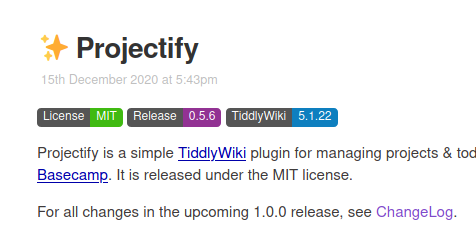

# Shields - Add project badges to your tiddlers

Shields provides a single macro `shield` to render a badge.

## Usage

```
<<shield label:License status:MIT>>
```

The `shield` macro takes three arguments: `label`, `status`, and optionally `colour`.

Four colours are available: `green` (the default), `red`, `blue`, and `purple`.

## Demo

This project is used in https://nicolas.petton.fr/tw/projectify.html to render
badges in the main tiddler.

<a href="./screenshots/example.png"></a>
 
